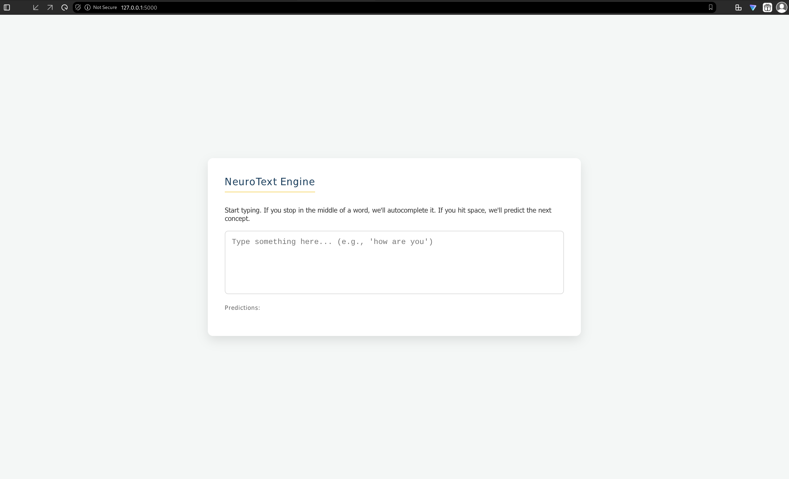
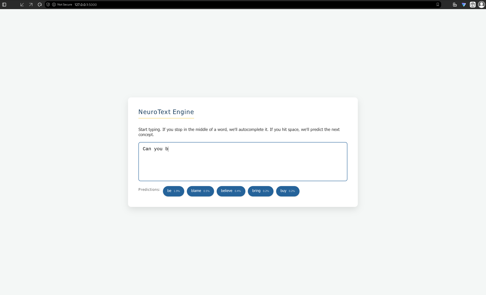
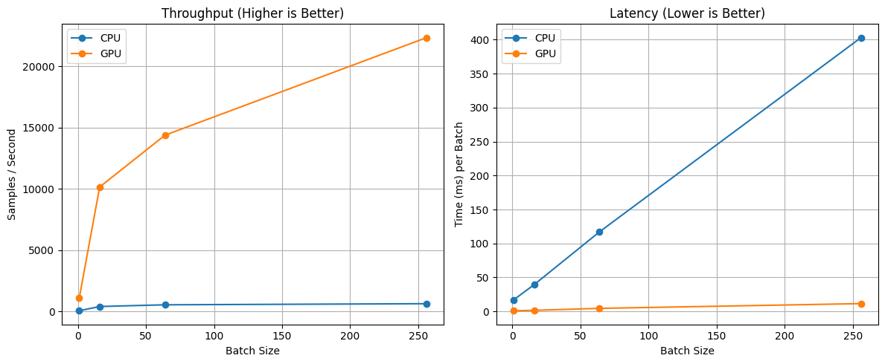

# GRU-Autocomplete: Neural Text Prediction Engine

A high-performance text autocomplete system built with deep learning that predicts next words and completes partial words in real-time. The model uses a Stacked GRU (Gated Recurrent Unit) architecture with self-attention, trained on Reddit discussion data and Daily Dialogue dataset.

## 🎯 Project Overview

This project implements an end-to-end text autocomplete pipeline:

1. **Data Preprocessing**: Processes raw text data from Reddit and Daily Dialogue datasets
2. **Sentence Segmentation**: Uses C++ with ICU library for fast sentence splitting
3. **Model Training**: Trains a Stacked GRU with self-attention mechanism using PyTorch Lightning
4. **Model Export**: Exports the trained model to ONNX format for universal compatibility
5. **Web Application**: Serves the model via Flask with real-time inference

### Key Features
- **Fast Inference**: ONNX-optimized model runs efficiently on CPU and GPU
- **Dual Prediction Modes**:
  - **Next-word prediction**: Suggests the next word when space is pressed
  - **Mid-word completion**: Autocompletes partial words as the user types
- **Probability-based Ranking**: Suggestions are ranked by confidence score
- **Lightweight**: Pre-trained model is only ~5-10MB
- **Low Latency**: Inference typically completes in <50ms

---

## 📁 Project Structure

```
GRU-Autocomplete/
├── my_app/
│   ├── app.py                      # Flask application server
│   ├── completion_model_reddit.onnx # Pre-trained ONNX model
│   ├── word2id.json                # Word to ID mapping
│   ├── id2word.json                # ID to word mapping
│   └── templates/
│       └── index.html              # Web UI
│
├── training/
│   ├── new_app.ipynb               # Full training pipeline (PyTorch + Lightning)
│   ├── fasttext_embedding.ipynb    # Embedding generation script
│   ├── arrow-process.ipynb         # Arrow/Parquet data processing
│   ├── sentence_segment.py         # Python sentence segmentation wrapper
│   ├── segmenter.cpp               # C++ ICU-based sentence segmenter
│   ├── frqCounter.cpp              # C++ word frequency counter
│   ├── process_reddit.cpp          # C++ Reddit data processor
│   ├── demo.py                     # Command-line demo script
│   ├── embedding_matrix.npz        # Pre-trained FastText embeddings
│   ├── completion_model_reddit.onnx # Model checkpoint
│   └── [various data files]        # Raw and processed datasets
│
├── lightning_logs/                 # PyTorch Lightning training logs and checkpoints
│   ├── version_0, version_1, ...   # Different training runs
│   └── checkpoints/                # Saved model checkpoints
│
├── demo.png                        # Screenshot: empty app interface
└── midword_inference.png           # Screenshot: mid-word completion example

```

---

## 🏗️ Architecture

### Model Architecture

The core model is a **Stacked GRU with Self-Attention**, optimized for sequence-to-sequence next-word prediction:

```
Input Sequence
    ↓
Embedding Layer (pre-trained FastText)
    ↓
Stacked GRU (3 layers, 512 hidden dim, 30% dropout)
    ↓
Self-Attention Mechanism
    ↓
Layer Normalization + Residual Connection
    ↓
Output Layer (Linear → Vocab Probabilities)
    ↓
Top-5 Predictions
```

### Configuration

```python
HIDDEN_DIM = 512          # GRU hidden dimension
NUM_LAYERS = 3            # Number of stacked GRU layers
DROPOUT = 0.3             # Dropout rate
BATCH_SIZE = 512          # Training batch size
LEARNING_RATE = 1e-3      # Adam optimizer learning rate
MAX_LEN = 30              # Maximum sequence length
VOCAB_SIZE = ~50k         # Total vocabulary size
```

### Training Details

- **Dataset**: ~800k+ sentences from Reddit discussions and Daily Dialogue
- **Loss Function**: Cross-Entropy Loss (ignores `<PAD>` and `<UNK>` tokens)
- **Optimizer**: Adam
- **Early Stopping**: Monitors validation loss with 2-epoch patience
- **Max Epochs**: 12
- **Precision**: BF16 mixed precision for memory efficiency
- **Hardware**: GPU-accelerated training (CUDA/CPU auto-detection)

---

## 🚀 Getting Started

### Prerequisites

- Python 3.8+
- CUDA 11.0+ (for GPU acceleration, optional)
- C++ compiler (g++ 9+) with ICU development libraries

### Installation

1. **Clone the repository**:
   ```bash
   git clone https://github.com/Hatem-707/GRU-Autocomplete.git
   cd GRU-Autocomplete
   ```

2. **Install Python dependencies**:
   ```bash
   pip install -r requirements.txt
   ```
   
   Key dependencies:
   - `torch` - PyTorch framework
   - `pytorch-lightning` - Training framework
   - `numpy` - Numerical computing
   - `flask` - Web server
   - `onnxruntime` - Model inference
   - `pyarrow`, `pandas` - Data processing

3. **Build C++ utilities (optional, for preprocessing)**:
   ```bash
   cd training/
   g++ -O3 -o segmenter segmenter.cpp -licu -lstdc++
   g++ -O3 -o frqCounter frqCounter.cpp -std=c++20
   ```

### Quick Start: Run the Web App

```bash
cd my_app/
python app.py
```

Then open your browser to `http://localhost:5000`

### Command-Line Demo

```bash
cd training/
python demo.py
```

This starts an interactive session where you can type sentence prefixes and get completions.

---

## 📊 Usage Examples

### Web Application


*Screenshot 1: Empty application interface ready for input*


*Screenshot 2: Real-time mid-word completion with probability scores*

### Interactive Features

1. **Type a sentence prefix**: `"how are you"`
   - Model predicts: `["doing", "today", "feeling", "going", "feeling"]`

2. **Partial word completion**: `"hap"` → predicts: `["happy", "happens", "happiness", "happened"]`

3. **Next-word prediction**: `"the weather is "` → suggests: `["very", "beautiful", "cold", "nice", "hot"]`

### Python API

```python
from app import get_predictions

# Next-word prediction
candidates = get_predictions("what is your name", prefix="")
# Returns: [{"word": "today", "prob": 0.156}, ...]

# Mid-word completion
candidates = get_predictions("hello", prefix="wor")
# Returns: [{"word": "world", "prob": 0.892}, ...]
```

---

## 🔧 Data Preprocessing Pipeline

### Step 1: Data Collection & Parsing

- **Reddit Data**: Extracted discussion threads and comments
- **Daily Dialogue**: Preprocessed conversational dataset
- Format: Parquet files (`train.parquet`, `valid.parquet`, `test.parquet`)

### Step 2: Sentence Segmentation

The project uses **C++ with ICU (International Components for Unicode)** for fast, robust sentence splitting:

**Why C++ + ICU?**
- **Speed**: ~100x faster than pure Python implementations
- **Unicode Support**: Handles multilingual text and edge cases
- **Accuracy**: Respects language-specific punctuation rules

```bash
# Build and run segmenter
cd training/
./segmenter < raw_corpus.txt > segmented.json
```

### Step 3: Tokenization & Vocabulary Building

1. **Word Frequency Counting** (C++):
   ```bash
   ./frqCounter  # Reads clean_big.json, outputs word frequencies
   ```

2. **Vocabulary Construction**:
   - Select top 50k most frequent words
   - Add special tokens: `<PAD>`, `<UNK>`, `<EOS>`
   - Create word2id and id2word mappings (JSON)

### Step 4: Embedding Generation

FastText embeddings (300-dim) are pre-trained and saved:
- File: `embedding_matrix.npz`
- Covers all vocabulary words
- Loaded during model initialization

---

## 🤖 Training

### Full Training Pipeline

Run the complete training notebook:

```bash
cd training/
jupyter notebook new_app.ipynb
```

**Notebook Structure**:
1. Load embeddings and vocabulary
2. Define Dataset and DataLoader
3. Build StacKed GRU + Self-Attention model
4. Train with PyTorch Lightning
5. Validate and evaluate
6. Export to ONNX

### Training Progress

The trainer logs metrics to TensorBoard:

```bash
tensorboard --logdir=lightning_logs/
```

Example metrics:
- `train_loss`: Cross-entropy loss per batch
- `val_loss`: Validation loss (lower is better)
- `val_acc`: Token-level accuracy (excluding special tokens)

### Resuming Training from Checkpoint

```python
from pytorch_lightning import Trainer
from your_model import CompletionModel

# Load checkpoint
checkpoint_path = "lightning_logs/version_2/checkpoints/epoch=11-step=67968.ckpt"
model = CompletionModel.load_from_checkpoint(checkpoint_path, ...)

trainer = pl.Trainer(...)
trainer.fit(model, train_dataloaders, val_dataloaders)
```

---

## 📦 Model Export & Deployment

### Exporting to ONNX

```python
import torch
from your_model import CompletionModel

model = CompletionModel(...)
model.load_state_dict(torch.load("checkpoint.pt")['state_dict'])

dummy_input = torch.randint(0, 100, (1, 5), dtype=torch.long)

torch.onnx.export(
    model,
    dummy_input,
    "completion_model.onnx",
    input_names=['input_ids'],
    output_names=['logits'],
    dynamic_axes={
        'input_ids': {0: 'batch_size', 1: 'sequence_length'},
        'logits': {0: 'batch_size', 1: 'sequence_length'}
    },
    opset_version=12
)
```

### Running Inference with ONNX

```python
import onnxruntime as ort
import numpy as np

session = ort.InferenceSession("completion_model.onnx")

# Prepare input
input_ids = np.array([[100, 234, 567]], dtype=np.int64)

# Inference
outputs = session.run(None, {'input_ids': input_ids})
logits = outputs[0]  # Shape: [1, seq_len, vocab_size]
```

---

## 🎨 Web Application Details

### Flask Backend (`my_app/app.py`)

**Endpoints**:

- `GET /`: Serves the HTML UI
- `POST /predict`: Predicts next words or completions
  - Request: `{"text": "how are"}`
  - Response: `{"candidates": [{"word": "you", "prob": 0.89}], "mode": "next_word"}`

**Key Features**:
- Softmax probability scaling
- Prefix filtering (for mid-word completion)
- Top-5 suggestions sorted by probability
- Special token filtering (`<PAD>`, `<UNK>`, `<EOS>`)

### Frontend (`my_app/templates/index.html`)

**Features**:
- Real-time typing detection
- Debounced API calls (200ms)
- Visual suggestion chips with probability badges
- Responsive design (mobile-friendly)
- Loading indicator during inference

**Technology**:
- HTML5 + CSS3
- Vanilla JavaScript (ES6)
- Fetch API for client-server communication

---

### Inference Benchmark Results
**Hardware:** AMD Ryzen 7 5800H (CPU) vs. NVIDIA RTX 3070 Laptop (GPU)

| Device | Batch Size | Latency (ms/batch) | Throughput (samp/s) |
| :--- | :---: | :---: | :---: |
| **CPU** (Ryzen 7 5800H) | 1 | 17.09 | 58.53 |
| | 16 | 39.41 | 405.94 |
| | 64 | 117.15 | 546.30 |
| | 256 | 403.00 | 635.23 |
| **GPU** (RTX 3070 Laptop) | 1 | **0.91** | 1,098.03 |
| | 16 | 1.57 | 10,160.77 |
| | 64 | 4.45 | 14,388.08 |
| | 256 | 11.46 | **22,343.69** |

***

### Key Takeaways
*   **Speedup:** At a batch size of 256, the RTX 3070 is approximately **35x faster** than the Ryzen 7 5800H (22,343 vs 635 samples/sec).
*   **Latency:** The GPU offers sub-millisecond latency for single items (0.91ms), making it excellent for real-time interactive usage.
*   **Scaling:** The GPU throughput scales massively as batch size increases, whereas the CPU starts to plateau around batch size 64-256.


*A graph showcasing the throughput and latency of the CPU and GPU used in testing*

### Model Accuracy

- **Token-level Accuracy**: ~28% on held-out test set of 2000 samples
  - *Note*: Autocomplete is inherently difficult; many valid next words exist
- **Top-5 Accuracy**: ~54%
  - Suggests the correct next word in top-5 predictions

### Model Size

- **PyTorch Model**: ~146MB (full state dict)
- **ONNX Model**: ~49MB (optimized)
- **Embeddings**: ~5.3MB (300-dim × 10k vocab)

---

## 🔬 Technical Details

### Special Tokens

| Token | ID | Purpose |
|-------|-----|---------|
| `<PAD>` | 0 | Padding sequences to uniform length |
| `<UNK>` | 1 | Unknown words not in vocabulary |
| `<EOS>` | 2 | End-of-sequence marker |

### Loss Function

The model uses **Cross-Entropy Loss** with ignored indices:

```python
loss_fn = nn.CrossEntropyLoss(ignore_index=-100)
```

Targets marked as `-100` are ignored during backpropagation:
- `<PAD>` tokens (sequence padding)
- `<UNK>` tokens (rare/unknown words)

This ensures the model only learns from valid, in-vocabulary predictions.

### Self-Attention Mechanism

```
Energy = Tanh(Linear(GRU_Output))
Weights = Softmax(Energy)
Context = Weights @ GRU_Output
```

This allows the model to focus on important tokens in the input sequence.

---

## 🛠️ Advanced: Custom Training

### Prepare Your Own Data

1. **Format**: Text file (one sentence per line)
   ```
   this is a sample sentence
   another example here
   ```

2. **Segment sentences** using C++:
   ```bash
   ./segmenter < your_data.txt > segmented.json
   ```

3. **Build vocabulary**:
   ```python
   from collections import Counter
   
   word_freq = Counter()
   with open('segmented.txt', 'r') as f:
       for line in f:
           words = line.split()
           word_freq.update(words)
   
   # Keep top 50k words
   vocab = {w: i+3 for i, (w, _) in enumerate(word_freq.most_common(50000))}
   vocab['<PAD>'] = 0
   vocab['<UNK>'] = 1
   vocab['<EOS>'] = 2
   ```

4. **Train embeddings**:
   Use FastText or GloVe to create embedding matrix

5. **Run training**:
   Modify `Config` in `new_app.ipynb` and execute

---

## 🐛 Troubleshooting

### ONNX Import Errors

```python
# Ensure ONNX dependencies are installed
pip install onnxruntime onnx
```

### GPU Not Detected

```python
import torch
print(torch.cuda.is_available())  # Should be True
print(torch.cuda.get_device_name(0))  # GPU name
```

### Out of Memory During Training

Reduce `BATCH_SIZE` in Config (e.g., 256 instead of 512)

### Slow Sentence Segmentation

Use pre-compiled C++ binary instead of Python:
```bash
# Compile with optimizations
g++ -O3 -march=native -o segmenter segmenter.cpp -licu
```

---

## 📝 References & Resources

- **PyTorch Lightning**: https://www.pytorchlightning.ai/
- **ONNX**: https://onnx.ai/
- **GRU Paper**: Cho et al., 2014 - "Learning Phrase Representations using RNN Encoder-Decoder"
- **Attention Mechanism**: Bahdanau et al., 2015 - "Neural Machine Translation by Jointly Learning to Align and Translate"
- **ICU Library**: https://unicode-org.github.io/icu/

---

## 📄 License

This project is open source. Feel free to use and modify for educational and commercial purposes.

---

## 👤 Author

Hatem-707

---

## 🤝 Contributing

Contributions are welcome! Areas for improvement:
- Support for other languages
- Beam search decoding (instead of greedy)
- Fine-tuning on domain-specific data
- Mobile app deployment
- Real-time streaming inference

---

## Changelog

### v0.1 (Current)
- ✅ Stacked GRU with self-attention
- ✅ ONNX export and inference
- ✅ Flask web application
- ✅ C++ preprocessing pipeline
- ✅ Mid-word completion + next-word prediction

### Future Improvements
- [ ] Transformer-based architecture (BERT/GPT style)
- [ ] Multi-language support
- [ ] Mobile app (React Native)
- [ ] Database caching for common completions
- [ ] User-specific model fine-tuning

---

**Last Updated**: January 2026
